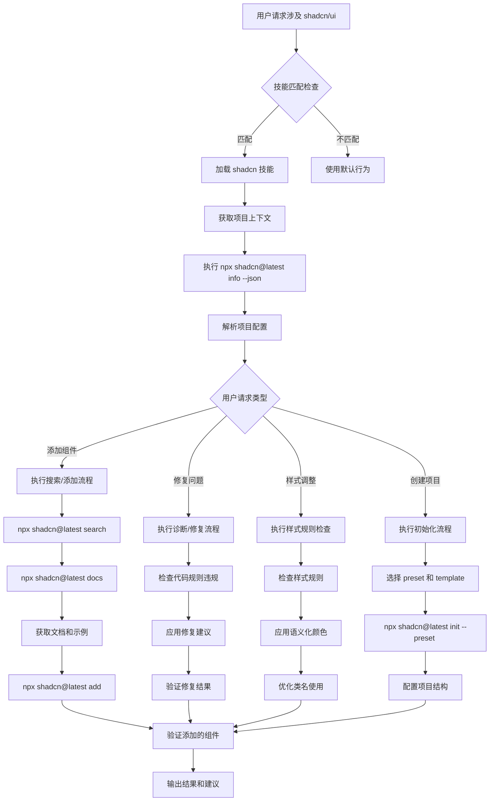

# shadcn Skill 调用逻辑说明

## 技能调用流程图



## 具体执行内容

### 1. 项目上下文获取
```bash
# 获取项目配置信息
npx shadcn@latest info --json
# 返回包含：
# - 已安装组件列表
# - 项目配置（aliases, isRSC, tailwindVersion等）
# - 框架信息
# - 包管理器类型
```

### 2. 组件搜索和文档获取
```bash
# 搜索组件
npx shadcn@latest search @shadcn -q "sidebar"

# 获取组件文档
npx shadcn@latest docs button dialog select
# 返回文档URL，然后获取内容
```

### 3. 组件添加流程
```bash
# 预览更改
npx shadcn@latest add button --dry-run

# 查看差异
npx shadcn@latest add button --diff button.tsx

# 添加组件
npx shadcn@latest add button card dialog
```

### 4. 规则检查和应用

#### 样式规则
- 使用语义化颜色（bg-primary, text-muted-foreground）
- 使用 gap-* 替代 space-x-*
- 使用 size-* 替代 w-* h-*
- 使用 cn() 进行条件类名处理

#### 组件组合规则
- 使用 FieldGroup + Field 替代 div + Label
- 使用 InputGroup 替代裸 Input
- 使用 ToggleGroup 替代手动按钮组
- 使用 Alert 替代自定义提示框

#### 图标规则
- 使用 data-icon 属性
- 不手动设置图标大小
- 传递图标对象而非字符串

### 5. 项目初始化
```bash
# 新建项目
npx shadcn@latest init --name my-app --preset base-nova

# 现有项目初始化
npx shadcn@latest init --preset base-nova
```

## 关键决策点

1. **组件选择**：优先使用现有组件而非自定义实现
2. **样式应用**：使用内置变体而非自定义样式
3. **规则遵循**：强制应用关键规则（Critical Rules）
4. **项目配置**：根据项目上下文调整建议

## 输出结果

- 代码修复建议
- 组件使用示例
- 样式优化方案
- 项目结构建议
- 错误诊断结果